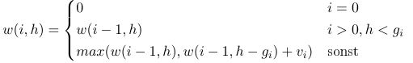

# 10. Programmieraufgabe: Dynamische Programmierung

## Allgemeine Hinweise

Bitte lesen Sie die folgenden Hinweise genau durch!

* Sie haben max. drei Versuche, eine korrekte Lösung einzureichen.
* Bitte verwenden Sie die `solution.py` als Basis. Beachten Sie dabei:
    - Behalten Sie die *Schnittstellen* der zu implementierenden Funktionen genau bei.
    - Fügen Sie *keinen* unnötigen *Code außerhalb der Funktionen* ein, d.h. *vermeiden* Sie auch die Verwendung von *globalen Variablen*.
    - Verwenden Sie *keine `input`- oder `import`-Anweisungen*.
* Testen Sie Ihren Code selbst mit den von uns zur Verfügung gestellten Tests, bevor Sie ihn einreichen! Sie können auch weitere Testfälle hinzufügen, die Sie sich selbst ausdenken! Wir testen Ihren Code ebenfalls noch mit zusätzlichen Eingaben.
* Die Abgabe erfolgt individuell. Kopieren von Code von anderen Studierenden ist verboten und wird als Betrugsversuch interpretiert.
* Verwenden Sie *Python 3* (nicht 2).

&nbsp;

**Für diese Aufgabe wird ingesamt 1 Punkt vergeben.**

&nbsp;

## Aufgabenstellung

In dieser Aufgabe sollen aus einer Menge von Objekten, die jeweils einen Wert (v) und ein Gewicht (g) haben, eine Teilmenge ausgewählt und in eine Box gelegt werden. 
Ziel ist es, den Gesamtwert der ausgewählten Objekte zu maximieren, ohne dabei das zulässige Gesamtgewicht zu überschreiten. Die Objekte können dabei nur ganz oder gar nicht ausgewählt werden. 

Sowohl die Gewichte als auch die Werte der Objekte liegen in Listenform vorbei, wobei ein beliebiger Index $i$ das Gewicht $g_i$ und den Wert $v_i$ des Objekts $i$ bestimmt. 

$w(i,h)$ bezeichnet den gesuchten optimalen Wert einer Box der Größe $h \leq G$. Es ergibt sich die Rekursionsgleichung: 

Jedes Objekt $i$ kann eingepackt werden oder auch nicht. Packt man es nicht ein, bleibt $h$ unverändert. Packt man das Objekt ein, verringert sich die Größe $h$ um das Gewicht des eingepackten Objekts $h-g_i$ (sofern $h-g_i \geq 0$) und der Wert erhöht sich um $v_i$. 

&nbsp;

Verwenden Sie das Paradigma der *dynamischen Programmierung* um mithilfe der Rekursionsgleichung den maximalen Wert $w$ zu finden. 

Schreiben Sie dazu eine Funktion `packing` in Python. Die Funktion erwartet als Eingabe ein zulässiges Höchstgewicht `G`, sowie zwei Listen `g` und `v` die jeweils das Gewicht und den Wert der Objekte enthalten. 

Als Ausgabe wird ein Tupel erwartet, mit dem Maximalwert an erster Position und der gesamten letzten Zeile der ausgefüllten Tabelle an zweiter Position. 

**Wichtig:** Es werden nur Lösungen, die das Paradigma der *dynamischen Programmierung* verwenden, akzeptiert. 

&nbsp;

## Beispiele

| Mustereingabe | Erwarteter Rückgabewert der Funktion `packing` |
| --- | --- |
| `5, [1,2,3], [6,10,12]` | `(22, [0,6,10,16,18,22])` |
| `5, [2,3,4,5], [3,4,5,6]` | `(7, [0,0,3,4,5,7])` |
| `10, [5,4,6,3], [10,40,30,50]` | `(90, [0,0,0,50,50,50,50,90,90,90,90])` |