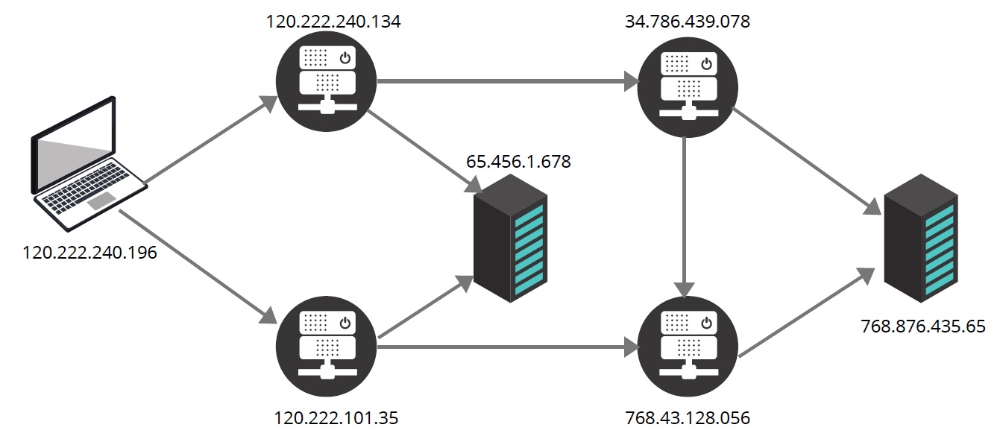
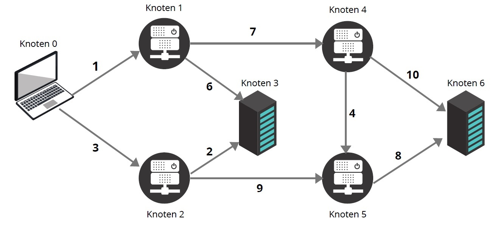

# 11. Programmieraufgabe: Greedy

## Allgemeine Hinweise

Bitte lesen Sie die folgenden Hinweise genau durch!

* Sie haben max. drei Versuche, eine korrekte Lösung einzureichen.
* Bitte verwenden Sie die `solution.py` als Basis. Beachten Sie dabei:
    - Behalten Sie die *Schnittstellen* der zu implementierenden Funktionen genau bei.
    - Fügen Sie *keinen* unnötigen *Code außerhalb der Funktionen* ein, d.h. *vermeiden* Sie auch die Verwendung von *globalen Variablen*.
    - Verwenden Sie *keine `input`- oder `import`-Anweisungen*.
* Testen Sie Ihren Code selbst mit den von uns zur Verfügung gestellten Tests, bevor Sie ihn einreichen! Sie können auch weitere Testfälle hinzufügen, die Sie sich selbst ausdenken! Wir testen Ihren Code ebenfalls noch mit zusätzlichen Eingaben.
* Die Abgabe erfolgt individuell. Kopieren von Code von anderen Studierenden ist verboten und wird als Betrugsversuch interpretiert.
* Verwenden Sie *Python 3* (nicht 2).

&nbsp;

**Für diese Aufgabe wird ingesamt 1 Punkt vergeben.**

&nbsp;

## Aufgabenstellung

&nbsp;

In dieser Aufgabe betrachten wir Rechnernetzwerke. Diese haben mehrere Bestandteile, wie z.B. Server, Router, Switches, Endknoten und andere Komponenten (siehe obige Abbildung). Unsere Rechner sind Endknoten. Um eine Webseite im Browser zu öffnen, muss eine Browser-Anfrage von einem Rechner durch mehrere Router zu einem Server wandern, der die Webseite hostet. Diese Kommunikation zwischen Geräten im Internet wird durch die TCP/IP-Protokolle gesteuert. Wenn Sie wollen, können Sie es selbst ausprobieren. Verfolgen Sie den Weg zu [www.uni-potsdam.de](www.uni-potsdam.de) im Terminal mit dem Befehl `traceroute www.uni-potsdam.de`. 

In dieser Aufgabe versuchen wir Routing im Netzwerk selbst zu implementieren. Dafür verwenden wir den klassischen *Greedy-Algorithmus*, wie er in der Vorlesung vorgestellt wurde (nicht Dijkstra). 

Als Eingabe erhalten Sie ein Netzwerk, das aus Endknoten und Routern besteht. Verbindungen zwischen Knoten haben unterschiedliche Antwortzeiten, die als Kantengewichte gegeben sind. In diesem Netzwerk werden die Knoten durch eine einfache Knotenindizierung unterschieden (siehe untere Abbildung).

&nbsp;

Das Netzwerk wird als gerichteter Graph in Adjazenzlistenrepräsentation übergeben. Die Besonderheit besteht darin, dass ein Element nicht nur den Index des benachbarten Knotens enthält, sondern zugleich auch noch das Kantengewicht. Ein Element ist somit ein Tupel `(index, weight)`. Es wird angenommen, dass alle Kantengewichte größer als $0$ sind.

Schreiben Sie die Funktion `greedy` in Python, die zwei Parameter bekommt: eine Adjazenzliste `adjL` und einen Startknotenindex `startNode`. Sie sollen mit Hilfe des klassischen Greedy Algorithmus den kürzesten Weg vom Startknoten `startNode` zu jedem anderen erreichbaren Knoten in dem Netzwerk finden. Sie können weitere Hilfsfunktionen für die Bestimmung aller benötigten Bestandteile des Algorithmus benutzen.

Als Ausgabe wird ein Tupel, bestehend aus der **Anzahl** aller möglichen kreisfreien Pfade, von einem gegebenen Startknoten aus, *(Menge E)* an erster Position und den **Gesamtkosten** aller kürzesten Pfade *(Menge M)* an zweiter Position erwartet. 

Eine Fehlerbehandlung für die Fälle, dass der Start- oder Zielknotenindex ungültig ist, oder die Adjazenzliste leer ist, **muss nicht** vorhanden sein.

**Wichtig:** Verwenden Sie zum Sortieren aller Pfade einen Ihrer bereits implementierten Sortieralgorithmen. Lösungen, die eingebaute Sortierfunktionen in Python wie z.B. list.sort(), sort(), sorted() oder ähnliche verwenden, werden nicht akzeptiert.

&nbsp;

## Beispiele

Das erste Beispiel haben Sie bereits in der Übung kennengelernt, das zweite Beispiel bezieht sich auf die obige Abbildung. 

| Mustereingabe | Erwarteter Rückgabewert der Funktion `greedy` |
| --- | --- |
| `[[(1,20),(6,30)],[(0,20),(3,40),(7,35)],[(4,40),(7,60)],[(2,70),(5,65)],[(5,10)],[(4,10)],[(2,30)],[(1,35)]], 0` | `(18, 435)` |
| `[[(1,1),(2,3)],[(3,6),(4,7)],[(3,2),(5,9)],[],[(5,4),(6,10)],[(6,8)],[]], 0` | `(10, 47)` |
| `[[(1,4),(2,100)],[(3,3)],[(3,3)],[(2,10),(1,3)],[]], 2` | `(2, 9)` |